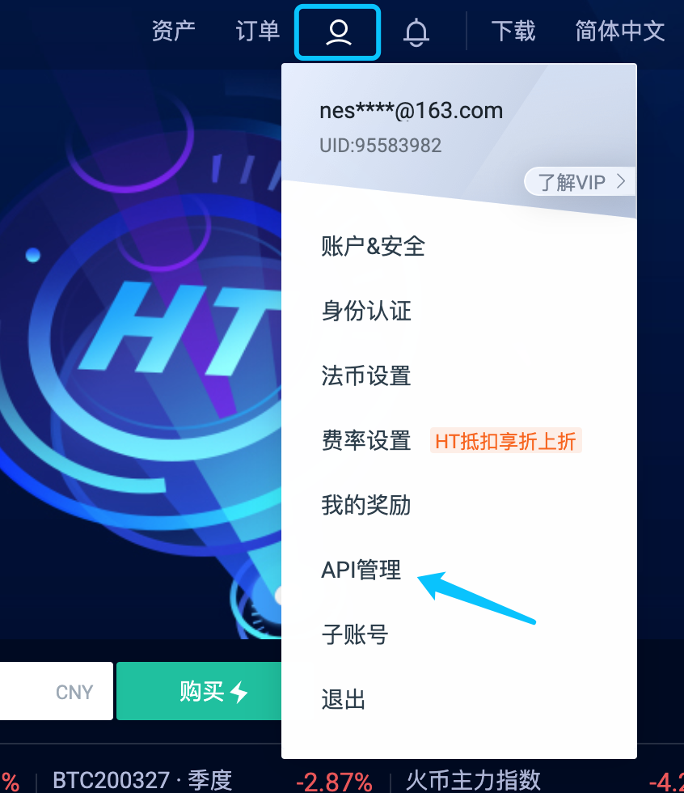

### NEST3.6自动验证套利程序操作说明

[toc]


#### 介绍
>NEST3.6自动验证套利程序是一个示例程序，可以根据本程序代码逻辑进行二次开发，开发中遇到任何问题，均可在github上提交问题，本程序开发人员会一一解答。

>本程序相关参数如价格偏离百分比，默认值为1%，并不一定是最优的验证套利比例，用户可根据实际情况自行调整。

>火币交易所对冲功能是一个可选功能，用户可自行选择是否开启对冲功能，目前仅支持火币交易所对冲，如需使用其他交易所进行对冲操作，可自行实现[HedgeService](https://github.com/NEST-Protocol/NEST-oracle-V3.6-verifier/blob/master/src/main/java/com/nest/ib/service/HedgeService.java)接口。

>验证套利程序主要功能有：
   * 检查账户资产、解冻资产、冻结资产情况。
   * ERC20代币授权。
   * 交易所价格更新（部分地区交易所获取价格需要开启全局VPN）。
   * 验证对冲功能。
   * 发起验证套利交易（可同时对TOKEN报价和NTOKEN报价进行验证，注意NTOKEN发行量超过500万时，才能进行NTOKEN验证）。
   * 解冻报价资产，支持单个解冻和批量解冻。
   * 取出合约内解冻资产。

#### 启动前准备

1. 准备好：钱包私钥及相关资产、以太坊节点URL、TOKEN代币合约地址、对应交易所交易对。
   * 钱包私钥：
   通过助记词生成，可通过nestDapp注册。
   * 资产：
   `ETH/USDT`和`ETH/NEST`报价验证套利至少需要准备90.5ETH、价值90ETH的USDT代币或NEST代币以及报价抵押的40万NEST。
   其他NTOKEN报价单验证套利至少需要准备30.5ETH、价值30ETH的TOKEN代币或NTOKEN代币和40万NEST。
   * 以太坊节点URL。
   * TOKEN代币合约地址：
   例如对`ETH/USDT`报价进行验证套利，那么就需要填写USDT代币合约地址`0xdac17f958d2ee523a2206206994597c13d831ec7`。
   * 交易所交易对设置：
   <br/>火币交易对查询地址 https://api.huobi.pro/v1/common/symbols
   <br/>霍比特交易对查询地址 https://api.hbtc.com/openapi/v1/pairs
   <br/>抹茶交易对查询地址 https://www.mxc.com/open/api/v2/market/symbols

#### 启动和关闭

1. 运行报价程序：
   * 前往[releases](https://github.com/NEST-Protocol/NEST-oracle-V3.6-verifier/releases) 下载  NEST-oracle-V3.6-verifier.zip 文件。
   * 双击报价程序根路径下start.bat，运行报价程序，会弹出窗口，请勿关闭，可在窗口查看验证报价、解冻资产等日志信息。
2. 登录：
   * 浏览器输入http://127.0.0.1:8099/main，会进入登录页面，默认用户名nest，密码nestqwe123!。
   * 如需修改密码，可修改src/main/resources/application.yml中的login.user.name（用户名）、login.user.passwd（密码）。
3. 关闭验证套利程序：
   * 关闭验证套利程序前先禁用TOKEN和NTOKEN验证套利，然后等待10分钟，待所有报价资产确认解冻完毕后再关闭窗口。

#### 相关设置

1. 以太坊节点（必填）：
   * 必须优先设置节点地址。
2. 设置TOKEN地址、选择价格源、填写交易所对应的TOKEN交易对（必填）：
   * 如果对`ETH/USDT`报价进行验证，TOKEN地址填`0xdac17f958d2ee523a2206206994597c13d831ec7`，可以选择`Huobi Exchange`，交易对应填写火币交易对`ethusdt`。
   * 如果对`ETH/COFI`报价进行验证，TOKEN地址填`0x1a23a6BfBAdB59fa563008c0fB7cf96dfCF34Ea1`，可以选择`Mc Exchange`，交易对应填写抹茶交易对`COFI_USDT`。
3. 设置NTOKEN价格源、交易所NTOKEN对应的交易对（当NTOKEN发行量大于500万时，可以对NTOKEN报价进行验证）：
   * 根据当前NTOKEN的市场情况，目前已经上交易所的有NEST、NHBTC、NYFI，对此可以选择不同的交易所获取价格：
     * 如果是获取NEST价格，可以选择`Huobi Exchange`，交易对应填写火币交易对`nesteth`。
     * 如果是获取NHBTC价格，可以选择`Huobi Exchange`，交易对应填写火币交易对`nhbtceth`。
     * 如果是获取NYFI价格，可以选择`Hbtc Exchange`，交易对应填写霍比特交易对`NYFIUSDT`。
   * 其他NTOKEN可以选择`Fixed price`，交易对可以不填，但是必须在下方输入框填写固定价格，即1ETH等价多少个NTOKEN。
4. TOKEN、NTOKEN价格源和交易对确定后，点击`confirm`按钮，后台日志会打印TOKEN和NTOKEN的代币信息、交易所价格信息，检查信息无误后继续后续操作。
5. 设置报价私钥（必填）：
   * 填写私钥，程序会进行授权检查，如果未授权，程序会自动发起授权交易，请确定授权交易打包成功后方可开启验证套利。
   * 默认会对TOKEN进行授权，如果NTOKEN发行量大于500万，则同时会对NTOKEN进行授权。
6. gasPrice 倍数配置（在默认gasPrice基础上进行加倍，可根据实际情况进行调整）。
7. 开启验证套利：
   * 以上配置完成后，便可开启验证套利，首先开启报价数据扫描，然后选择是否开启TOKEN验证或NTOKEN验证。


#### 测试验证套利

```
1. 将发起验证套利的代码注释：
   
    BigInteger gasPrice = ethClient.ethGasPrice(gasPriceState.baseBiteType);
    String minerAddress = priceSheetPub.miner.getValue();
    String transactionHash = ethClient.bite(method, wallet, gasPrice, nonce, typeList, payEthAmount);

2. 打开 http://127.0.0.1:8099/main ,进行相关配置后，开启报价数据扫描，开启验证。

3. 查看后台窗口打印的验证报价数据，核对数据。
```

#### 火币交易所开放API-KEY

1. 登陆火币交易所，选择API管理

   

2. 创建API-KEY并开放权限。

   * 默认开放“读取”，可以进行火币交易所余额查询。
   * 必须开放“交易”权限，进行吃单验证后才能进行对冲操作。

   

3. 填写好之后，点击“创建”，此时会显示：api-key 和 api-secret。将其填写到配置页面，并点击“确认”。
