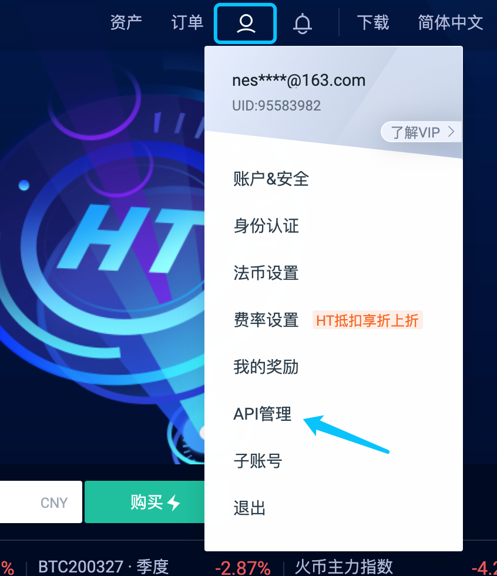
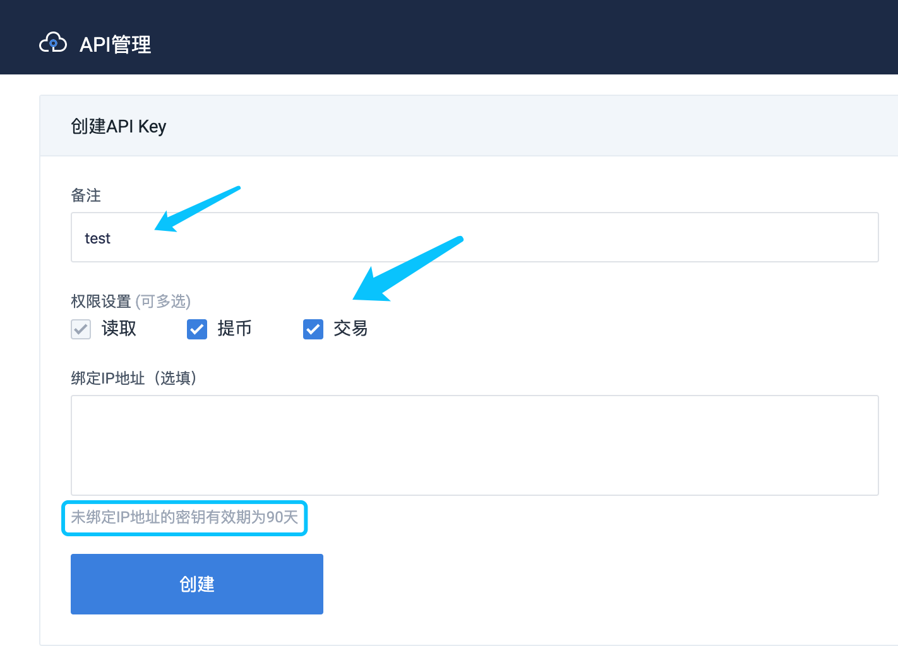

### NEST 3.6 Automatic Verification Arbitrage Program Operating Instructions
[toc]


#### Introduction
>NEST3.6 automatic verification arbitrage program is a sample program, which can be used for secondary development according to the code logic of this program. Any problems encountered during development can be submitted on Github, and the developers of this program will answer them in time.

>The relevant parameters of this program such as the price deviation percentage, the default value is 1%, which is not necessarily the optimal verification arbitrage ratio, and the user can adjust it according to the actual situation.

>Huobi Exchange's hedging function is an optional feature. Users can choose whether to enable the hedging function. Currently, only Huobi Exchange hedging is supported. If you need to use other exchanges for hedging operations, you can implement it by yourself [HedgeService](https://github.com/NEST-Protocol/NEST-oracle-V3.6-verifier/blob/master/src/main/java/com/nest/ib/service/HedgeService.java) interface.

>The main functions of the verification arbitrage program are:
   * Check account assets, unfrozen assets, and frozen assets.
   * Authorize ERC20 token.
   * Update the prices on exchange (some regional exchanges need to open the global VPN to obtain prices).
   * Verify the hedging function.
   * Initiate verification arbitrage transactions (both TOKEN quotation and NTOKEN quotation can be verified and verified at the same time. Note that NTOKEN verification can only be performed when the issuance of NTOKEN exceeds 5 million).
   * Unfreeze quotation assets, support single thawing and batch thawing.
   * Withdraw the unfreezing assets in the contract.

#### Preparation Before Start

1. Get ready: wallet private key and related assets, Ethereum node URL, TOKEN contract address, and corresponding exchange trading pair.
   * Wallet private key:
    Generated by mnemonic, can be registered through nestDapp. 
   * assets:
    <br/>If you verify the `ETH/USDT` or `ETH/NEST` quotation, at least 90.5 ETH, 90 ETH worth of USDT tokens or NEST tokens and mortgage of 400,000  NEST are required.
    <br/>For other NTOKEN quotation,at least 30.5 ETH, 30 ETH worth of TOKEN or NTOKEN and mortgage of 400,000  NEST are required.
   * Ethereum node URL.
   * TOKEN contract address:
    For example, to verify arbitrage for the quotation of `ETH/USDT`, you need to fill in the USDT token contract address `0xdac17f958d2ee523a2206206994597c13d831ec7`.
   * Exchange trading pair settings:
    <br/>Huobi trading pair query address https://api.huobi.pro/v1/common/symbols
    <br/>HBTC trading pair query address https://api.hbtc.com/openapi/v1/pairs
    <br/>MXC trading pair query address https://www.mxc.com/open/api/v2/market/symbols

#### Start and Close

1. Run the quotation program:
   * Go to [releases](https://github.com/NEST-Protocol/NEST-oracle-V3.6-verifier/releases) to download the lastest release NEST-oracle-V3.6-verifier.zip file.
   * Double-click start.bat under the root path of the quotation program to run the quotation program, a window will pop up, please do not close it. You can view log information such as verifying quotation and unfreezing assets in the window.
2. Login:
   * Enter http://127.0.0.1:8099/main in the browser to enter the login page, the default user name is nest, and the password is nestqwe123!.
   * If you need to modify the password, you can modify login.user.name (user name) and login.user.passwd (password) in src/main/resources/application.yml.
3. Close the verification arbitrage program:
   * Forbidden TOKEN and NTOKEN verification arbitrage before closing the verification arbitrage program, and then wait 10 minutes, and then close the window after all quotation assets are confirmed and unfreezed.

#### Related Settings

1. Ethereum node (required):
   * The node address must be set first.
2. Set the TOKEN address, select the price source, and fill in the TOKEN trading pair corresponding to the exchange (required):
   * To verify the quotation of `ETH/USDT`, fill in the TOKEN address with `0xdac17f958d2ee523a2206206994597c13d831ec7`, you can select `Huobi Exchange`, and fill in the Huobi trading pair `ethusdt` corresponding to the transaction.
   * If you verify the `ETH/COFI` quotation, fill in the TOKEN address with `0x1a23a6BfBAdB59fa563008c0fB7cf96dfCF34Ea1`, you can select `Mc Exchange`, and fill in the matcha transaction pair `COFI_USDT` for the transaction.
3. Set the NTOKEN price source and the corresponding trading pair of the exchange NTOKEN (when the NTOKEN issuance is greater than 5 million, the NTOKEN quotation can be verified):
    * According to the current market situation of NTOKEN, NEST, NHBTC, and NYFI are currently listed on the exchange. You can choose different exchanges to obtain the prices:
      * To obtain the NEST price, you can select `Huobi Exchange`, and fill in the Huobi exchange pair `nesteth` corresponding to the transaction.
      * To obtain the NHBTC price, you can select `Huobi Exchange`, and fill in the Huobi trading pair `nhbtceth` corresponding to the transaction.
      * To obtain the NYFI price, you can select `Hbtc Exchange`, and fill in the HBTC trading pair `NYFIUSDT` corresponding to the transaction.
    * For other NTOKENs, you can select `Fixed price`, and the transaction pair can be left blank, but the fixed price must be filled in the input box below, that is, how many NTOKENs are equivalent to 1ETH.
4. After the TOKEN and NTOKEN price sources and trading pairs are confirmed, click the `confirm` button. The background log will print the token information of TOKEN and NTOKEN and exchange price information. After checking the information, it will continue to the follow-up operation.
5. Set quotation private key (required):
   * Fill in the private key, the program will perform authorization checks, if not authorized, the program will automatically initiate an authorized transaction, please make sure that the authorized transaction is packaged successfully before you can open the verification arbitrage.
   * TOKEN will be authorized by default. If NTOKEN issuance is bigger than 5 million, NTOKEN will be authorized at the same time.
6. GasPrice multiple configuration (doubled on the basis of the default gasPrice, can be adjusted according to the actual situation).
7. Start the verification arbitrage:
   * After the above configuration is completed, you can open the verification arbitrage. First, open the quotation data scan, and then choose whether to open TOKEN verification or NTOKEN verification.
   * Note that if the NTOKEN issuance is less than 5 million before the program is launched, the program will not authorize NTOKEN by default. If the NTOKEN issuance reaches 5 million after the program is started and running, if you want to verify the NTOKEN quotation, you need to restart the program, the program will perform the NTOKEN authorization operation at this time, or you can manually authorize it yourself.

#### Test and Arbitrage Verification
```
1. Comment on the code that will initiate verification arbitrage:   
    BigInteger gasPrice = ethClient.ethGasPrice(gasPriceState.baseBiteType);
    String minerAddress = priceSheetPub.miner.getValue();
    String transactionHash = ethClient.bite(method, wallet, gasPrice, nonce, typeList, payEthAmount);

2. Open http://127.0.0.1:8099/main, and after relevant configuration, open the quotation data scan and open the verification.

3. View the verified quotation data printed in the background window and verify the data.

```

#### Huobi Exchange Opens API-KEY

1. Log in to Huobi Exchange and choose API management
   

2. Create API-KEY and open the permission.

    * "Read" is enabled by default, and you can check the balance of Huobi Exchange.
    * The "transaction" permission must be opened, and the hedging operation can only be performed after taking the order verification.

   

3. After filling in, click "Create", then it will display: api-key and api-secret. Fill it in the configuration page and click "Confirm".
